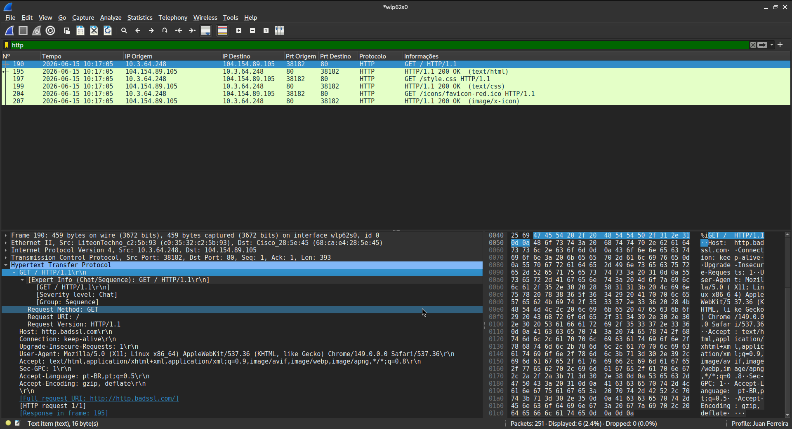
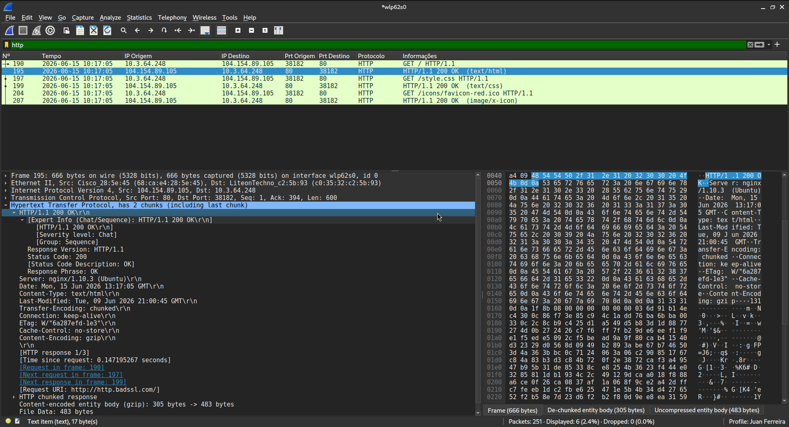

# Tráfego HTTP gerado pelo navegador

**Discentes:** Juan Pablo Ferreira Costa, Nadson Nascimento Santos e Vitor Mozer Vieira Sales



O site acessado foi o http://http.badssl.com/ indicado no campo Host da requisição. Por não usar criptografia SSL/TLS é possível visualizar de forma direta as requisições HTTP. Há a presença do método de requisição GET onde é buscado os arquivos de texto html e css que compõe a página além de arquivos de imagem como o ícone que fica na barra do navegador.

### Exemplo de cabeçalho de resposta do HTML



### Conteúdo HTML do pacote de resposta HTTP/1.1 200 OK  (text/html)

```html
Line-based text data: text/html (20 lines)
    <!DOCTYPE html>\n
    <html>\n
    <head>\n
      <meta charset="utf-8">\n
      <meta name="viewport" content="width=device-width, initial-scale=1">\n
      <link rel="shortcut icon" href="/icons/favicon-red.ico"/>\n
      <link rel="apple-touch-icon" href="/icons/icon-red.png"/>\n
      <title>http.badssl.com</title>\n
      <link rel="stylesheet" href="/style.css">\n
      <style>body { background: red; }</style>\n
    </head>\n
    <body>\n
    <div id="content">\n
      <h1 style="font-size: 8vw;">\n
        http.badssl.com\n
      </h1>\n
    </div>\n
    \n
    </body>\n
    </html>\n
```

### Conteúdo CSS do pacote de resposta HTTP/1.1 200 OK  (text/css)

```css
Line-based text data: text/css (88 lines)
    html, body {\n
      height: 100%;\n
      margin: 0;\n
      padding: 0;\n
    }\n
    \n
    body {\n
      background: gray;\n
      display: flex;\n
      flex-direction: column;\n
    }\n
    \n
    #content {\n
      text-align: center;\n
    \n
      /* Fill the entire height of the page above the footer. */\n
      flex: 1;\n
    \n
      /* Center child items */\n
      display: flex;\n
      flex-direction: column;\n
      align-items: center;\n
      justify-content: center;\n
    }\n
    \n
    #content h1 {\n
      margin: 0em auto;\n
      color: white;\n
      font-weight: bold;\n
      font-family: "Source Code Pro", Monaco, Consolas, "Courier New", monospace, Impact;\n
      font-size: 7vw;\n
      text-shadow:\n
        0 0 20px rgba(255, 255, 255, 0.5),\n
        0 0 40px rgba(255, 255, 255, 0.5),\n
        0 0 60px rgba(255, 255, 255, 0.5);\n
    }\n
    \n
    #content img.mixed {\n
      width: 20vh;\n
      max-width: 256;\n
      margin-top: 5vh;\n
    }\n
    \n
    #content input {\n
      min-width: 15em;\n
    }\n
    \n
    #content input, button {\n
      text-align: center;\n
      font-size: 2vw;\n
    }\n
    \n
    #log {\n
      list-style: none;\n
      padding-inline-start: 0px;\n
      color: white;\n
      font-family: Helvetica, Tahoma, sans-serif;\n
      font-size: 2vw;\n
    }\n
    \n
    #footer {\n
      padding: 2vh 2vw;\n
      background: rgba(0, 0, 0, 0.25);\n
      color: white;\n
      text-align: center;\n
      font-family: Helvetica, Tahoma, sans-serif;\n
      font-size: 3vw;\n
    \n
      /* Size based on content */\n
      flex: 0 0 content;\n
    }\n
    \n
    #footer a {\n
      color: white;\n
      transition: all 150ms;\n
    }\n
    \n
    #footer a:hover {\n
      text-shadow:\n
        0px 0px 20px rgba(255, 255, 255, 0.5),\n
        0px 0px 40px rgba(255, 255, 255, 0.5),\n
        0px 0px 60px rgba(255, 255, 255, 0.5);\n
    }\n
    \n
    #footer #http-vs-https {\n
      height: 1.5em;\n
      vertical-align: middle;\n
    }
```

