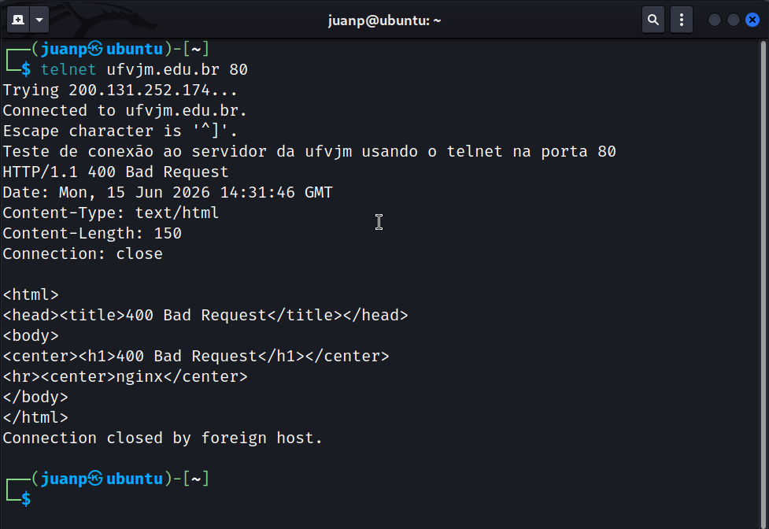
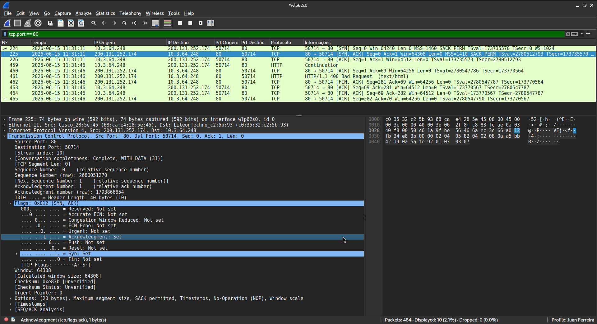

# Tráfego TCP gerado no estabelecimento de conexão

**Discentes:** Juan Pablo Ferreira Costa, Nadson Nascimento Santos e Vitor Mozer Vieira Sales

Após uma tentativa de estabelecer uma conexão com o servidor, é possível visualizar uma série de pacotes ACK e SYN que mostram exatamente como acontece o processo de 3-way handshake realizado pelo protocolo TCP.
1. O cliente envia um pacote SYN.
2. O servidor responde com um pacote SYN e com um pacote ACK.
3. O cliente responde com um pacote ACK estabelecendo assim a conexão entre cliente e servidor.

Na captura de tela acima é mostrado mais detalhadamente a questão das FLAGS, o pacote de nº 225 enviado do servidor para o cliente contém as flags SYN e ACK com o valor 1 e as demais com valor 0. Além disso, é possível notar também nesse caso que a partir do pacote de nº 462 inicia-se o encerramento da conexão pelo processo de 4-way handshake também feito pelo TCP. Como o canal é bidirecional, é necessário que cada um dos lados encerrem a conexão.