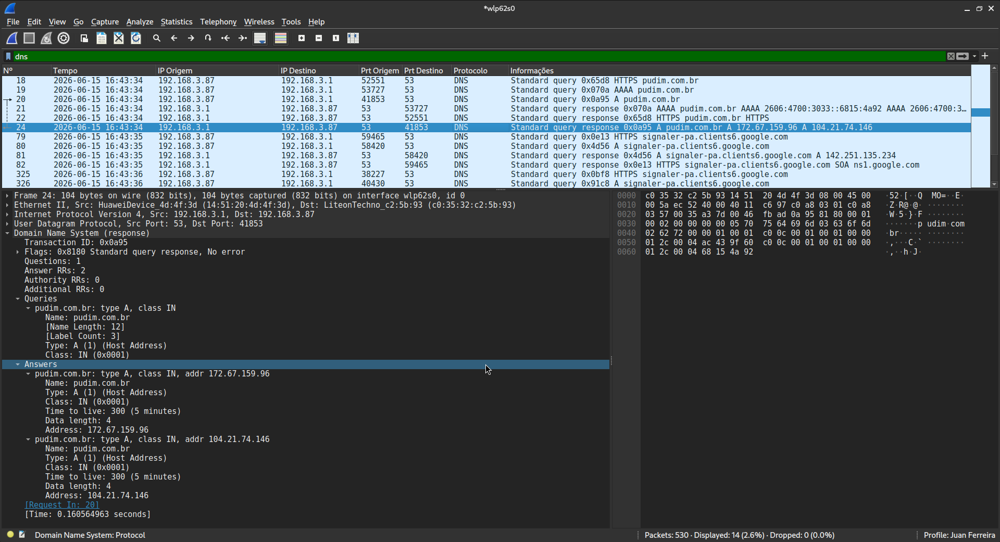

# Tráfego gerado através de consulta via DNS

Ao acessar o site https://pudim.com.br/ é observado o processo de resolução de nomes pelo DNS (Domain Name System). O processo tem início no pacote de nº 18 porém é no pacote de nº 20 que o cliente envia uma consulta solicitando o endereço IP do https://pudim.com.br/. Essa resposta chega no pacote de nº 24 com o mesmo Transaction ID 0x0a95. 

O dispositivo com endereço IP 192.168.3.1 (Roteador) atua como intermediário entre o cliente e o servidor e é por isso que as respostas chegam desse dispositivo para o cliente na rede local. Sobre os registros de DNS obtidos, eles estão localizados na sessão "Answers" do pacote nº 24 indicando que o servidor retornou os endereços resolvidos 172.67.159.96 e 104.21.74.146 para https://pudim.com.br/.