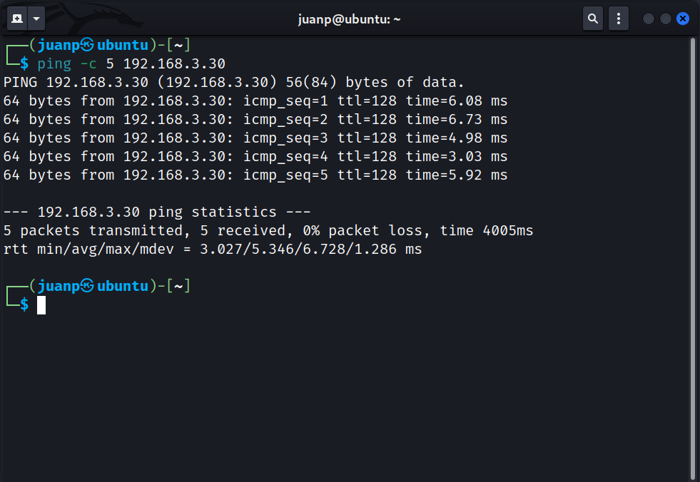
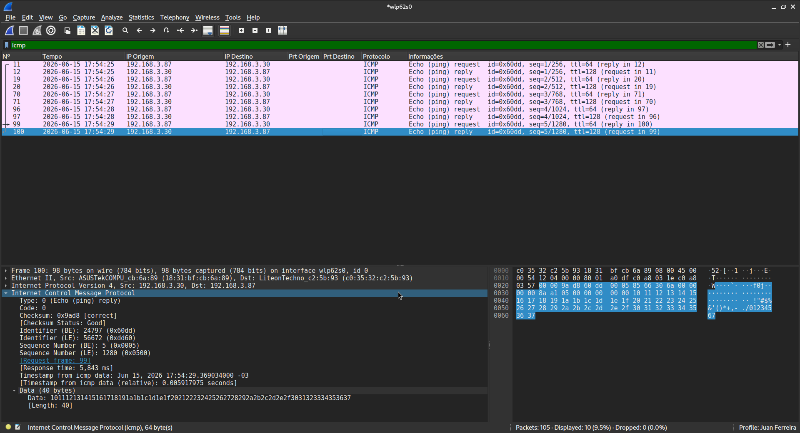

# Tráfego gerado pelo comando ping

**Discentes:** Juan Pablo Ferreira Costa, Nadson Nascimento Santos e Vitor Mozer Vieira Sales

O terminal e o wireshark mostram o trafego de pacotes ICMP (Internet Control Message Protocol) entre dois dispositivos na rede local. O primeiro mostra que todos os 5 pacotes foram enviados e recebidos com sucesso e o segundo mostra que para cada pacote request enviado há um pacote reply devolvido para o dispositivo. Na aba Internet Control Message Protocol é possível visualizar mais detalhes sobre os pacotes como o tipo, status do checksum e timestamp dentre outros.