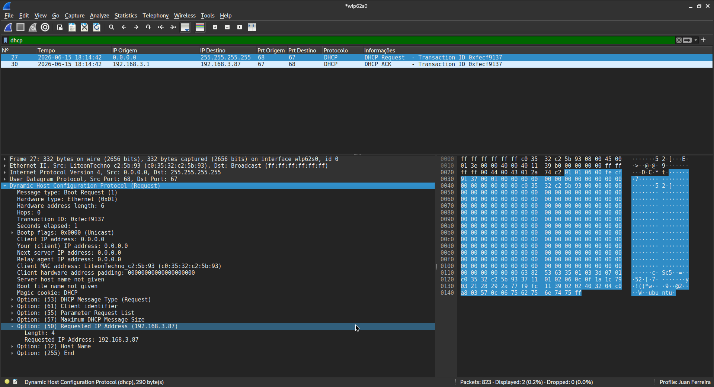
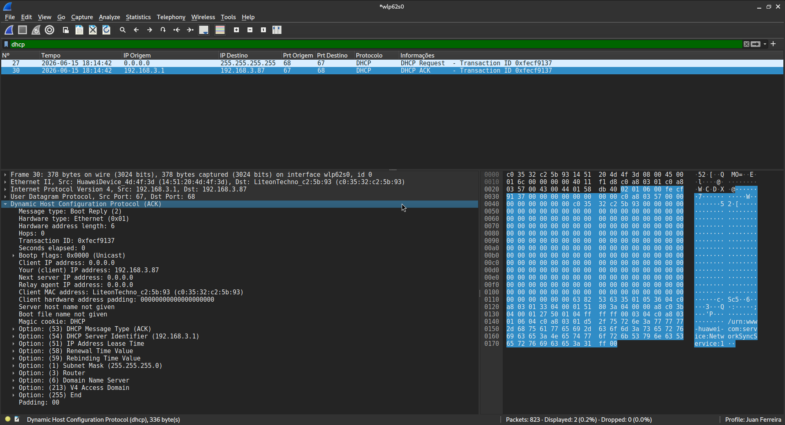
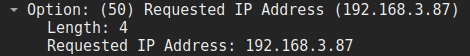

# Tráfego gerado pelo DHCP

Ao desligar e ligar manualmente a rede Wi-Fi, o dispositivo envia uma mensagem em broadcast (255.255.255.0) solicitando um endereço IP. 

O roteador então (atuando como DHCP da rede) responde ao dispositivo com um endereço IP e um ACK confirmando que recebeu a solicitação. Um fato interessante é que o Linux ainda guardava na memória o último endereço IP utilizado, então o dispositivo "pergunta" se pode continuar usando aquele mesmo endereço, isso pode ser conferido na primeira imagem na aba Dynamic Host Configuration Protocol (Request) em:

